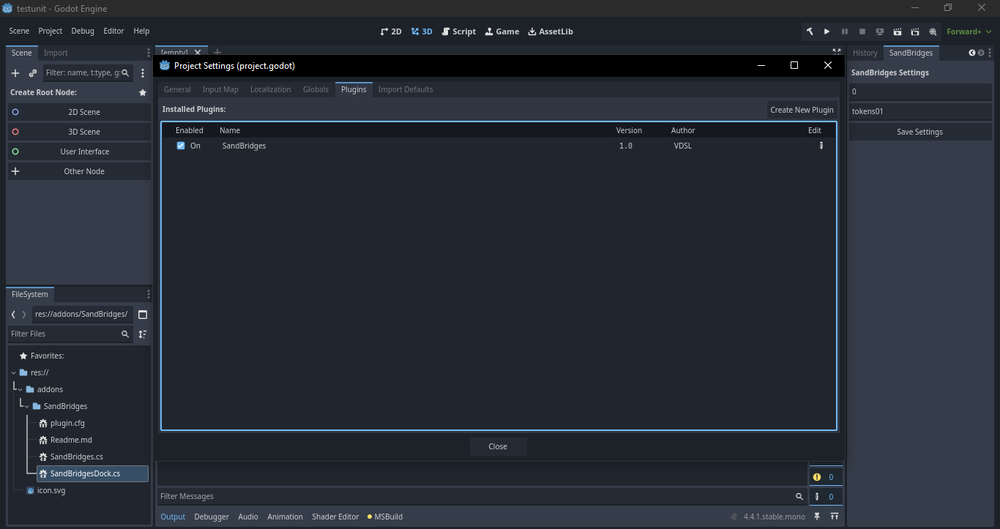
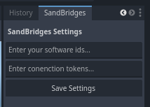

<h1>SandBriges Plugin</h1>
A simple achievement plugin for ThouSands Gateway community developer/publisher to add an universal achievement for their user to display on the forum or CrossGate client

## Table of Contents

- [What is this plugin is about?](#What-is-this-plugin-is-about?)
- [Table of Contents](#table-of-contents)
- [Installation](#Installation)
- [Usage](#Usage)

## Installation
Current version of SandBridges have been only tested using the godot 4 and .Net 6.0 enviroment or newer<br>
To install the plugin in your project, first download the project as a zip file<br>
- then extract to `addons/` directory in your game project
- open the project and build the project before activating (Alt+B in Godot Editor or "dotnet build" in terminal)
- Open Project tab in the toolbar then go to Project Settings → Plugins and activate SandBridges plugin like this
<div align="center">
     
</div>

## Usage
Before using the plugin, make sure you have your software ids and connection token [here](https://www.thousands.org/Library/softawareAdministration/manage.php) as without both you can't make connection to the platform.<br>
then make sure you have the achievementIds that will be used match to the registered achievement for your software, you can check [them here](https://www.thousands.org/Library/softawareAdministration/manage.php) if you don't have it already.<br>
If you already have the prequisite, the next step is to open Editor tab from the toolbar and select Editor Dock → SandBridges dock panel then set your software ids & connection token and click the save button.
<div align="center">
    
</div>

achievement plugin will triggered when using the call function
```bash
SandBridges.InitiateAchievement(this, "achievementIds", "userProfileTags");
```
